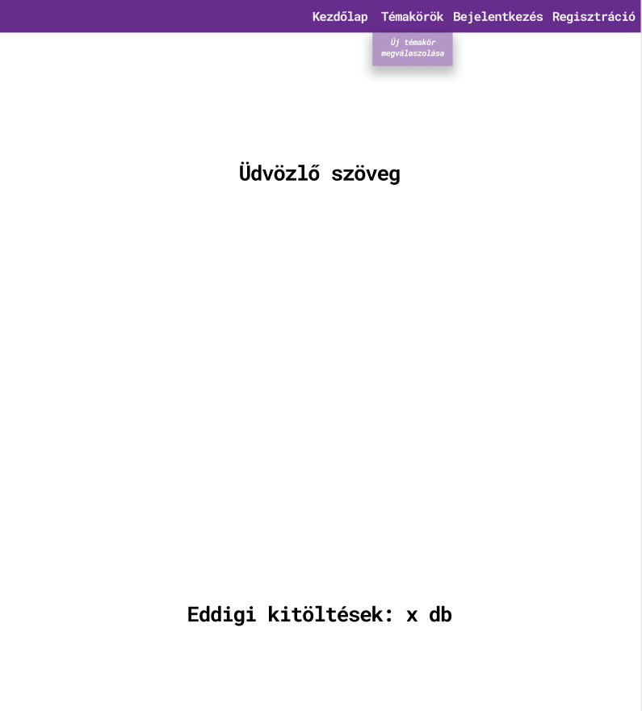
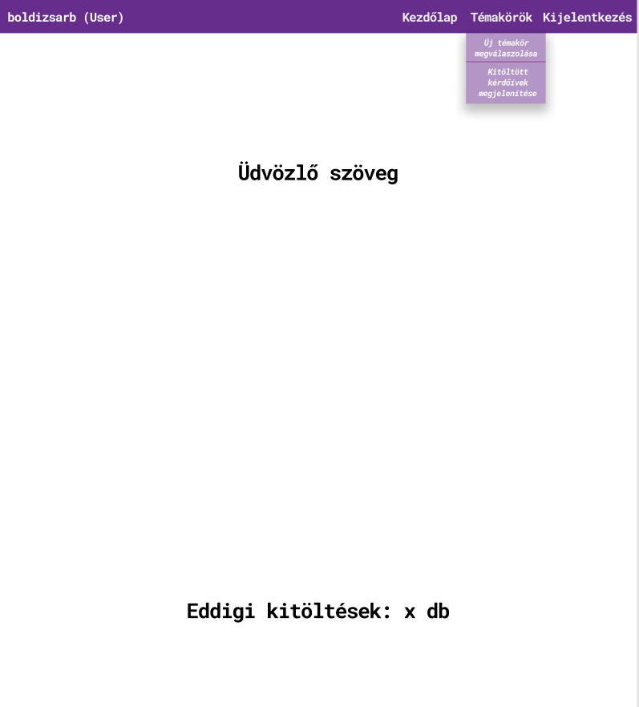
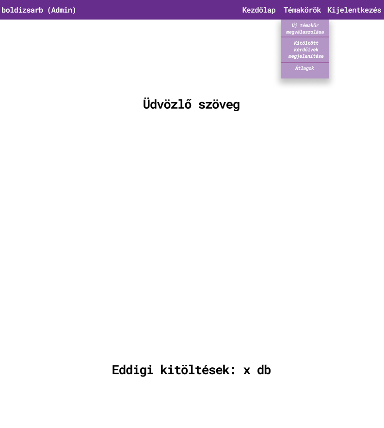
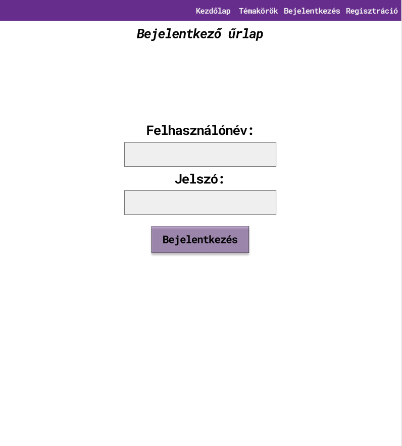
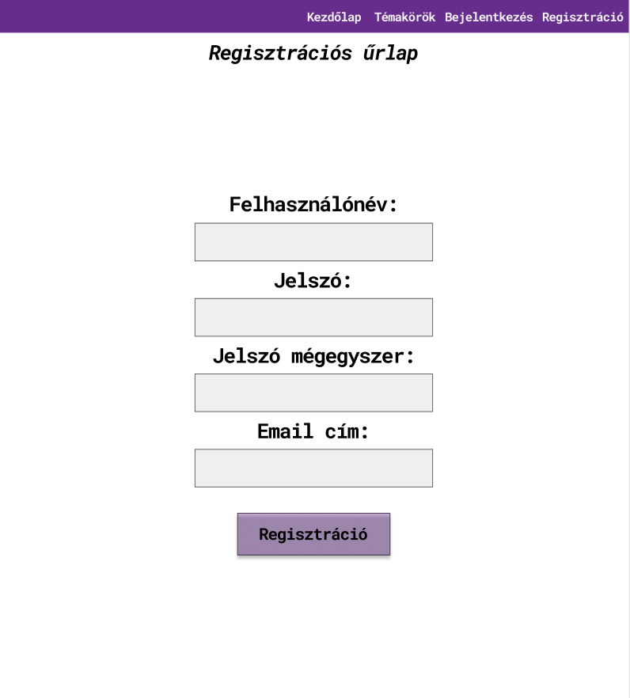
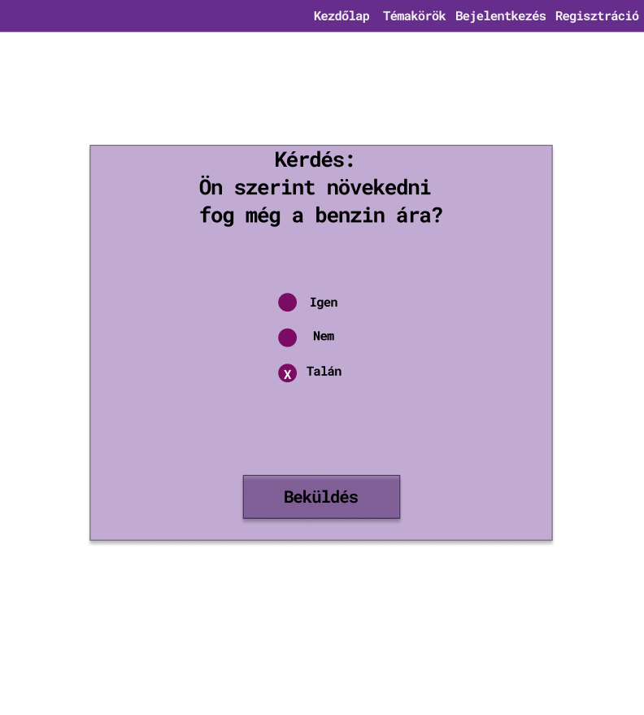
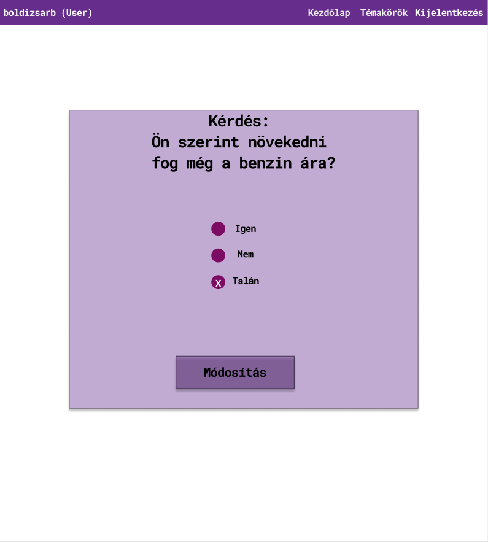
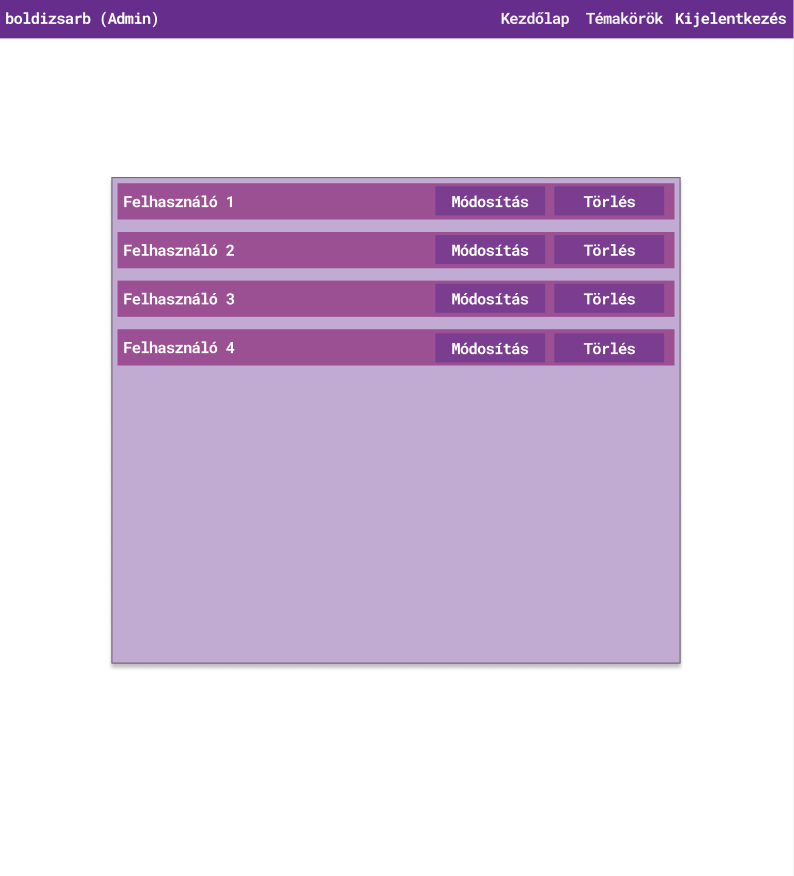
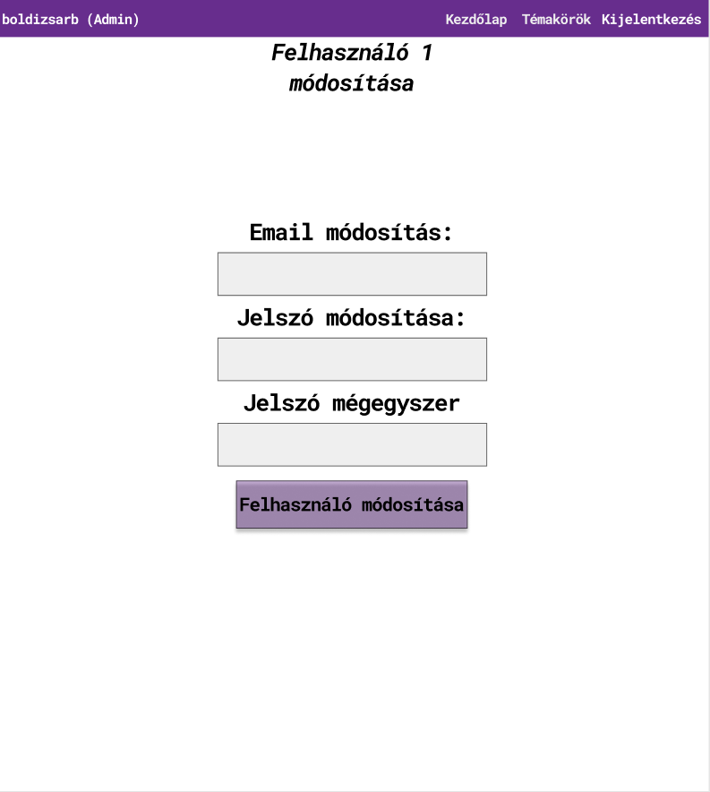
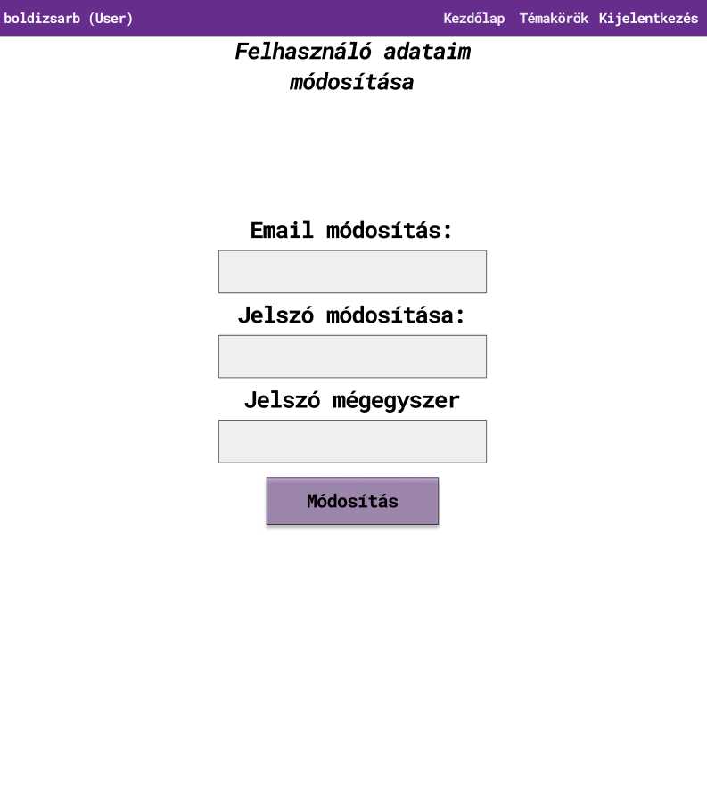

## 1. Áttekintés

A rendszer célja egy Webes felülettel rendelkező elektronikus teszt kitöltő oldal. Ezen a felületen a regisztrált és regisztráció nélküli felhasználok kérdésekre tudnak válaszolni. 
Ezeket a válaszokat az alkalmazás eltárolja, és képes lesz kimutatni azt, hogy az emberek többsége mit gondol. Ez alapján egy átlagot fog mutatni, amit mondhatni "kilogikázta".
Az oldal igyenes lesz és csak adatbegyűjtésre lesz alkalmas lényegében. A kérdések például időjárással, kriptovalutákkal vagy bankjegyek értékével kapcsolatosak lesznek.

## 2. Jelenlegi helyzet

A mai világban nagyon sokat számítanak az adatok,információk és azok minősége, gondoljunk itt akár az álhírekre és ezek súlyára.
Minden az online térben mozog, félrevezető információk, átverések. Gondoljuk csak el hány olyan hirdetéssel találkoztunk, ahol közel semmi pénz befektetésével a befizetett pénzünk akár 10-20 szorosát ígérik, akár valami startup kriptovaluta projekten, vagy valami mágikus algoritmus segítségével.
Hatalmas kényelmet és biztonságot jelentene az embereknek, ha lenne egy olyan egységes rendszer, ahol az információ valós, így jön szóba ez a rendszer.
A felhasználók kérdéseket kapnak egy adott témában, azt a rendszer kiértékeli, elemzi és a többségi arány alapján lehet majd megtekinteni az eredményeket. A rendszer mind mobilon, mind weben elérhető lesz, így nem kell azoknak sem aggódniuk, akiknek nincs számítógépük vagy esetleg okostelefonjuk, a rendszer univerzális megoldást hoz mindkét esetre, hogy a felhasználók minőségi információkhoz jussanak.
A minőségi információt biztosítja a CAPTCHA amely védi az adatok minőségét oly módon, hogy egy kis teszt keretében ki kell választani a korrekt megoldást, ezzel ellehetlenítve a botok iránti adatrontás esélyét. Ilyen kis teszt például, hogy válasszuk ki amelyik képkockákon vonat található, esetleg fordítsunk el egy figurát a korrekt irányba.

## 3. Követelménylista

1. Bejelentkezési felület:
 * A felhasználók ezen a felületen tudnak bejelentkezni a weboldalra, ám a weboldal számos része elérhető regisztráció nélkül is, de a regisztráció ajánlott.
2. Regisztrációs felület:
 * A felhasználók ezen a felületen tudnak regisztrálni a weboldalra, így feloldva a többi extra lehetőséget.
3. Kitöltött kérdőíveim menüpont:
 * A regisztrált felhasználók itt érik el a bővebb funkciókat.
 * Meg tudják tekinteni az általuk kitöltött kérdőíveket és a hozzájuk tartozó válaszokat.
 * A kitöltött kérdőíveikhez tartozó válaszaikat tudják módosítani és törölni is.
 * Felhasználók átlag válaszait meg tudja tekinteni az egyes témakörökben.
 * Ki tudnak jelentkezni
4. Jogosultságok:
 * Admin: Teljes hozzáférése van a weboldalhoz, szerkesztheti, kilistázhatja és törölheti a felhasználók adatait is, továbbá kérdőíveket vehet fel a rendszerbe, módosíthatja azokat, vagy akár törölheti is őket.
 * Vendég: Név nélkül ki tudja tölteni a publikus kérdőíveket, de a leadott válaszokat nem tudja módosítani.
 * Felhasználó: Meg tudja jeleníteni a kitöltendő kérdőíveket. A rendszer az általa kitöltött kérdőívek válaszát eltárolja, és ki tudja listázni a saját válaszokat, ezeket tudja szerkeszteni és törölni.

## 4. Jelenlegi üzleti folyamatok modellje

## 5. Igényelt üzleti folyamatok modellje
    5.1 Bejelentkezés
        5.1.1 Témakörök megjelenítése
                5.1.1.1 Új témakör megválszolása
                5.1.1.2 Általam kitöltött kérdőívek válaszainak megjelenítése
                5.1.1.3 Általam kitöltött kérdőívek válaszainak módosítása
                5.1.1.4 Általam kitöltött kérdőívek válaszainak törlése
        5.1.2 Kijelentkezés
    5.2 Bejelentkezés nélküli felhasználók jogai:
        5.2.1 Témakörök megjelenítése
                5.2.1.1 Új témakör megválszolása
        5.2 Regisztráció
        5.3 Felhasználók átlag válaszainak megjelenítése
    
## 6. Használati esetek

- **Belépve**
  - **Hozzáfér az összes kérdőívhez**
    - **Tartalma:**
    - **Kérdések**
    - **Saját válaszok**
    - **Mások átlag válasza**
  - **Új kérdőív kitöltése**
  - **Kitöltött kérdőív válaszának szerkesztése**
  - **Kitöltött kérdőív válaszának törlése**
- **Nem belépve**
  - **Hozzáfér a publikus kérdőívekhez**
    - **Új kérdőív kitöltése**
    - **Mások átlag válasza**

## 7. Képernyőterv

Kezdőlap bejelentkezés nélkül

Kezdőlap bejelentkezés után (user)

Kezdőlap bejelentkezés után (admin)

Bejelentkező felület

Regisztrációs felület

Témakörök

Témakör megválaszolása

Megválaszolt témakörök

Megválaszolt témakör módosítása

Átlag válaszok

Admin felület

Felhasználó módosítása adminként

Felhasználó módosítása felhasználóként

## 8. Forgatókönyv

A program nem kíván különösebb telepítési és használati útmutatót. Elég, ha egy grafikus felülettel rendelkező webböngésző fel van telepítve ( alapértelmezett: windows - internet explorer / edge, linux: mozilla, mac - safari ). A felhasználó beüti az oldal címét: xyz.com a böngésző címsorába és rögtön át lesz irányítva az oldalra. Az oldal tartalmát a webszerver szolgáltatja a mögötte lévő adatbázis segítségével. Az oldalra átírányítva a felhasználó megkezdheti a kérdések megválaszolását ha regisztrált az oldalra, majd bejelentkezett. Ha a felhasználónak bármi nemű problémája akad az oldal működésével kapcsolatban, akkor a megadott elérhetőségek alapján tudja ezt jelezni az oldal karbantartói felé. Az oldal adminisztrátorai moderálják az oldalt a megfelelő eszközök segítségével. Az oldal karbantartásáért felelős csapat pedig az oldal rendeltetésének megfelelő működését ellenőrzi és javítja a felmerülő problémákat.

## 9. Fogalomszótár

- **UML** - Unified Modeling Language
- **Reszponzív felület** - Mobilon, Tableten, PC-n igazodik a
képernyőhöz a felület mérete, azaz több eszközön is probléma nélkül
üzemelhet
- **Corrective Maintenance:** A felhasználók által felfedezett és "user reportban"
elküldött hibák kijavítása.
- **Adaptive Maintenance:** A program naprakészen tartása és finomhangolása.
- **Perfective Maintenance:** A szoftver hosszútávú használata érdekében végzett
módosítások, új funkciók, a szoftver teljesítményének és működési
megbízhatóságának javítása.
- **Preventive Maintenance:** Olyan problémák elhárítása, amelyek még nem
tűnnek fontosnak, de később komoly problémákat okozhatnak.