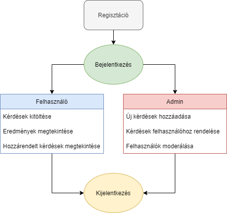

## 1. Áttekintés

A rendszer célja egy Webes felülettel rendelkező elektronikus teszt kitöltő oldal. Ezen a felületen a regisztrált és regisztráció nélküli felhasználok kérdésekre tudnak válaszolni. 
Ezeket a válaszokat az alkalmazás eltárolja, és képes lesz kimutatni azt, hogy az emberek többsége mit gondol. Ez alapján egy átlagot fog mutatni, amit mondhatni "kilogikázta".
Az oldal igyenes lesz és csak adatbegyűjtésre lesz alkalmas lényegében. A kérdések például időjárással, kriptovalutákkal vagy bankjegyek értékével kapcsolatosak lesznek.

## 2. Jelenlegi helyzet

## 3. Követelménylista

## 4. Jelenlegi üzleti folyamatok modellje

## 5. Igényelt üzleti folyamatok modellje
    5.1 Bejelentkezés
        5.1.1 Témakörök megjelenítése
                5.1.1.1 Új témakör megválszolása
                5.1.1.2 Általam kitöltött kérdőívek válaszainak megjelenítése
                5.1.1.3 Általam kitöltött kérdőívek válaszainak módosítása
                5.1.1.4 Általam kitöltött kérdőívek válaszainak törlése
        5.1.2 Kijelentkezés
    5.2 Bejelentkezés nélküli felhasználók jogai:
        5.2.1 Témakörök megjelenítése
                5.2.1.1 Új témakör megválszolása
        5.2 Regisztráció
        5.3 Felhasználók átlag válaszainak megjelenítése
    
## 6. Használati esetek

- **Belépve**
  - **Hozzáfér az összes kérdőívhez**
    - **Tartalma:**
    - **Kérdések**
    - **Saját válaszok**
    - **Mások átlag válasza**
  - **Új kérdőív kitöltése**
  - **Kitöltött kérdőív válaszának szerkesztése**
  - **Kitöltött kérdőív válaszának törlése**
- **Nem belépve**
  - **Hozzáfér a publikus kérdőívekhez**
    - **Új kérdőív kitöltése**
    - **Mások átlag válasza**

## 7. Képernyőterv

## 8. Forgatókönyv

A program nem kíván különösebb telepítési és használati útmutatót. Elég, ha egy grafikus felülettel rendelkező webböngésző fel van telepítve ( alapértelmezett: windows - internet explorer / edge, linux: mozilla, mac - safari ). A felhasználó beüti az oldal címét: xyz.com a böngésző címsorába és rögtön át lesz irányítva az oldalra. Az oldal tartalmát a webszerver szolgáltatja a mögötte lévő adatbázis segítségével. Az oldalra átírányítva a felhasználó megkezdheti a kérdések megválaszolását ha regisztrált az oldalra, majd bejelentkezett. Ha a felhasználónak bármi nemű problémája akad az oldal működésével kapcsolatban, akkor a megadott elérhetőségek alapján tudja ezt jelezni az oldal karbantartói felé. Az oldal adminisztrátorai moderálják az oldalt a megfelelő eszközök segítségével. Az oldal karbantartásáért felelős csapat pedig az oldal rendeltetésének megfelelő működését ellenőrzi és javítja a felmerülő problémákat.

## 9. Fogalomszótár
