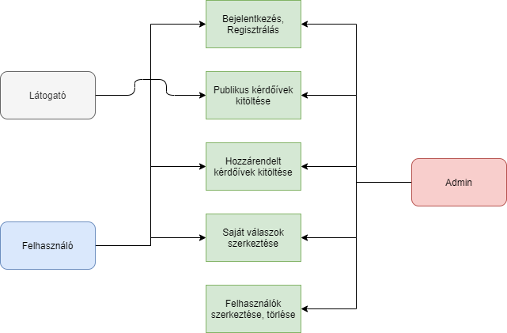
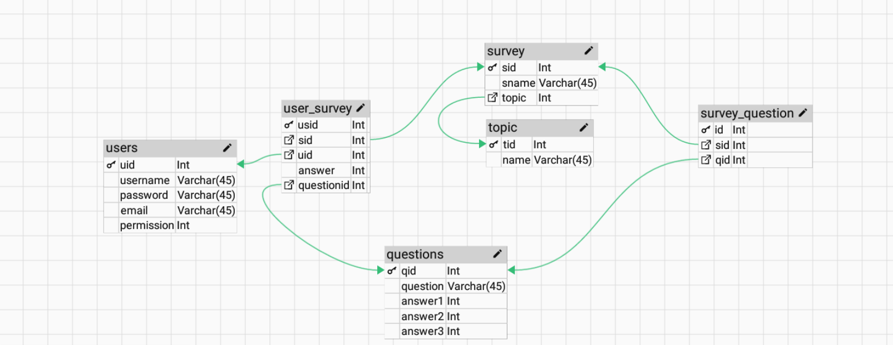

## 1. Rendszer célja

A rendszer célja egy Webes felülettel rendelkező elektronikus teszt kitöltő oldal. Ezen a felületen a regisztrált és regisztráció nélküli felhasználok kérdésekre tudnak válaszolni. 
Ezeket a válaszokat az alkalmazás eltárolja, és képes lesz kimutatni azt, hogy az emberek többsége mit gondol. Ez alapján egy átlagot fog mutatni, amit mondhatni "kilogikázta".
Az oldal igyenes lesz és csak adatbegyűjtésre lesz alkalmas lényegében. A kérdések például időjárással, kriptovalutákkal vagy bankjegyek értékével kapcsolatosak lesznek.
## 2. Projektterv

### Projekttszerepkörök:
  * Termék tulajdonos: WIP csapat
### Projekttmunkások és felelősségek:
  * Backend munkálatok: Csapat tagjai
  * Frontend munkálatok: Csapat tagjai

### Feladatuk: 
- adatbázis létrehozása az adatok tárolásához
- megfelelő funkciók elkészítése az oldal megfelelő működésének érdekében
- felhasználókezelés alkalmazása.
- felhasználói felület kialakítása

### Ütemterv:
 - 10.26 Követelmény specifikáció 
 - 10.26 Funkcionális specifikáció
 - 11.09 Rendszerterv
 - 11.14 Adatbázis kialakítása
 - 11.16 Felhasználókezelés megvalósítása
 - 11.16 Backend funkciók elkészítése
 - 11.16 Frontend design megtervezése
 - 11.16 Felhasználói felület kialakítása

## 3. Üzleti folyamatok modellje



## 4. Követelmények

**Funkcionális követelmények**
  - **Felhasználók adatainak tárolása**
  - **Felhasználók tudják változtatni adataikat**
  - **Felhasználók tudjanak kérdőíveket kitölteni**
  - **Felhasználók tudjék a leadott válaszokat módosítani és törölni**
  - **Adminisztrátor tudja létrehozni a kérdőíveket**
  - **Adminisztrátor tudja szerkeszteni a kérdőíveket, azok adatait és a felhasználók adatait**

  **Nem funkcionális követelmények**
  - **A felhasználók nem férnek hozzá egymás adataihoz**
  - **A felhasználók nem férnek hozzá az admin felülethez**

  **Törvényi előírások, szabványok:**
  - **GDPR-nek való megfelelés**


## 5. Funkcionális terv

**Rendszerszereplők:**
  - **Adminisztrátor**
  - **Felhasználó**
  - **Vendég**

  **Rendszerhasználati esetek és lefutásaik:**
  - **Adminisztrátor**
    - **Képes felhasználókat törölni**
    - **Tudja módosítani a felhasználók jelszavát és adatait is**
    - **Látja az összes regisztrált felhasználót**
    - **Fel tud venni kérdőíveket**
    - **Módosítani tudja a kérődíveket, azok adatait**
    - **Teljes hozzáférése van a rendszerhez**
  - **Felhasználó**
    - **Megtekintheti a kérdőíveket**
    - **Megtekintheti a kérdőívhez leadott válaszokat**
    - **Törölheti a korábban megadott válaszokat az egyes kérdőívekből**
    - **Módosíthatja a saját adatait**
    - **Módosíthatja jelszavát**
  - **Vendég**
    - **Megtekintheti a kérdőíveket**
    - **Megtekintheti a kérdőívhez leadott válaszokat**
    - **Képes regisztrálni és bejelentkezni**

  - **Menü-hierarchiák:**
    - **Bejelentkezés**
    - **Regisztráció**
    - **Kérdőívek**

    - **Bejelentkezés után:**
      - **Felhasználók listája:** kizárólag admin joggal rendelkező felhasználóknak
        - **Felhasználó adatainak módosítása**
        - **Felhasználók törlése**

      - **Kérdőív létrehozása:** kizárólag admin joggal rendelkező felhasználóknak
      - **Profil**
      - **Kijelentkezés**
## 6. Fizikai környezet

- **Az alkalmazás csak web platformra készül, AWS EC2 instance-ra telepített Apache szerveren, MySQL adatbázissal lesz futtatva.**
  - **Nincsenek megvásárolt komponensek.**
  - **Fejlesztői eszközök:**
    - **Visual Studio Code**
    - **Notepad++**
    - **Sublime text 3**
    - **MySQL Workbench**
    - **XAMPP**

## 7. Architekturális terv

A rendszer tökéletes működéséhez szükség van egy adatbázis szerverre, ebben az esetben MySql-t használunk. A bootstrap mint CSS keretrendszer felel a reszponzív webdesign-ért. A backend php alapú.

## 8. Adatbázis terv

### **Táblák**
- **users:** Minden felhasználó, aki az oldalon regisztrált
  - **uid:** Azonosító szám, mindenképp felvesz egy egész típusú értéket, amit a rendszer automatikusan generál és egyesével növekszik, nem lehet két azonos szám
  - **username:** A felhasználók regisztrációkor megadott neve, nem lehet üres
  - **password:** Nem lehet üres a mező, legalább 8 karakter
  - **email:** Egyedi, tehát nem lehet két felhasználónak ugyanazon email címe és egyben nem lehet üres mező
  - **permission:** Egész érték, nem lehet üres mező 

- **user_survey:** Kapcsolótábla ami össze kapcsolja az user és survey táblákat
  - **usid:** Általános azonosító a rekordhoz, elsődleges kulcs
  - **sid:** Másodlagos kulcs a survey-hez
  - **uid:** Másodlagos kulcs az user táblához
  - **answer:** Szövegesen a válasz értéke, azért szükséges mert ha "egyéb" opció által mi magunk adunk egy egyedi választ a kérdésre akkor itt tárolódik el
  - **questionid:** Másodlagos kulcs az question táblához amiben benne van, hogy hanyadik választ választották

- **survey:** Kérdőív tábla
  - **sid:** Általános azonosító a rekordhoz, elsődleges kulcs
  - **sname:** Kérdőív neve
  - **topic:** Kérdőív témájának másodlagos kulcsa
  
- **topic:** Kérdőív témája tábla
  - **tid:** Általános azonosító a rekordhoz, elsődleges kulcs
  - **name:** Téma elnevezése
  
- **survey_question:** Kérdőív és kérdései kapcsoló tábla
  - **id:** Általános azonosító a rekordhoz, elsődleges kulcs
  - **sid:** Másodlagos kulcs a survey-hez
  - **qid:**Másodlagos kulcs a question tábla elsődleges kulcsához
  
- **questions:** Kérdések tábla
  - **qid:** Általános azonosító a rekordhoz, elsődleges kulcs
  - **question:** A kérdő mondat ami megjelenik a képernyőn
  - **answer1:** Első válasz lehetőség
  - **answer2:** Második válasz lehetőség
  - **answer3:** Harmadik válasz lehetőség


**DSL**
```
CREATE TABLE users (
uid INT NOT NULL PRIMARY KEY,
username VARCHAR(45) NOT NULL,
password VARCHAR(45) NOT NULL,
email INT NOT NULL,
permission INT NOT NULL);

CREATE TABLE survey (
sid INT NOT NULL PRIMARY KEY,
sname INT NOT NULL,
topic INT NOT NULL);

CREATE TABLE user_survey (
usid INT NOT NULL PRIMARY KEY,
sid INT NOT NULL,
uid INT NOT NULL,
answer INT NOT NULL,
questionid INT NOT NULL);

CREATE TABLE topic (
tid INT NOT NULL PRIMARY KEY,
name INT NOT NULL);

CREATE TABLE questions (
qid INT NOT NULL PRIMARY KEY,
question VARCHAR(45) NOT NULL,
answer1 INT NOT NULL,
answer2 INT NOT NULL,
answer3 INT NOT NULL);

CREATE TABLE survey_question (
id INT NOT NULL PRIMARY KEY,
sid INT NOT NULL,
qid INT NOT NULL);

ALTER TABLE survey ADD CONSTRAINT survey_topic_topic_tid FOREIGN KEY (topic) REFERENCES topic(tid);
ALTER TABLE user_survey ADD CONSTRAINT user_survey_sid_survey_sid FOREIGN KEY (sid) REFERENCES survey(sid);
ALTER TABLE user_survey ADD CONSTRAINT user_survey_uid_users_uid FOREIGN KEY (uid) REFERENCES users(uid);
ALTER TABLE user_survey ADD CONSTRAINT user_survey_questionid_questions_qid FOREIGN KEY (questionid) REFERENCES questions(qid);
ALTER TABLE survey_question ADD CONSTRAINT survey_question_sid_survey_sid FOREIGN KEY (sid) REFERENCES survey(sid);
ALTER TABLE survey_question ADD CONSTRAINT survey_question_qid_questions_qid FOREIGN KEY (qid) REFERENCES questions(qid);

```
**UML**



## 9. Implementációs terv

A webes felület HTML, CSS és PHP nyelven fog elkészülni. A különböző technológiákat amennyire csak lehet, külön fájlokba írva készítjük el, úgy csatoljuk egymáshoz ezzel is egy átláthatóbb, könnyebben változtatható és bővíthető weboldal lesz. Az adatokat egy MYSQL adatbázisban fogjuk tárolni.

## 10. Tesztterv

Az alább leírt tesztelések célja a rendszer és funkcióinak teljes körű vizsgálata, ellenőrzése.

Gombok, linkek tesztelése: tesztünk célja: a weboldalon megjelenő gombok és linkek megfelelő működésének ellenőrzése.
Adatrögzítések leelenőrzése, hogy sikeresen feltöltődtek-e az adatbázisba. 
Adatok betöltése az adatbázisból.
Műveletek tesztelése: Törlés, módosítás, hozzáadás, megjelenítés.
A jelszavakkal biztonságos tárolásának ellenőrzése.
Hibás, hiányos adatok esetén adott hibaüzenetek ellenőrzése.
A weboldal helyes működésének letesztelése különböző böngészőkben például Microsoft Edge, Google Chrome, Firefox…
A weboldal hibátlan megfelelő megjelenés tesztelése számítógépen illetve mobiltelefonon.

## 11. Telepítési terv

A szoftver webes felületéhez csak egy böngésző telepítése szükséges.

**Windows - Microsoft Edge**

**Linux - Mozilla Firefox**

**Mac - Safari**

A webszerverre közvetlenül az internetről kapcsolódnak rá a kliensek. A weboldal URL címét szükséges ismerni és ezt beírni a böngésző címsorába.

## 12. Karbantartási terv

A felhasználók egy report formájában tudják jelenteni a felmerűlő funkcionális hibákat az adminok felé, amit a fejlesztők fognak kijavítani. A javított hibák egy oldalon Changelog vagy hír formában meg fognak jelenni visszajelzésként a felhasználók felé, az új funkciók / frissítésekkel együtt. A karbantartási időkről a felhasználókat egy e-mail formájában előre tájékoztatjuk.